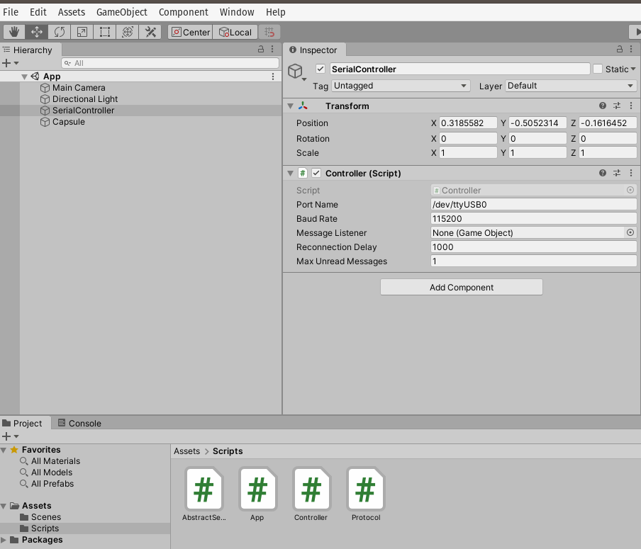

Semana 6
===========

Solución al parcial 1
-----------------------
Una posible solución al parcial 1 correspondiente a la acción de mejora es:

Código de arduino
^^^^^^^^^^^^^^^^^^^

.. code-block:: cpp
    :linenos:

    void setup() {
      Serial.begin(115200);

    }

    void loop() {
      static uint16_t x = 0;
      static uint16_t y = 0;
      static uint16_t z = 0;
      static bool countUp = true;

      if (Serial.available()) {
        if (Serial.read() == 0x73) {
          Serial.write((uint8_t)( x & 0x00FF));
          Serial.write( (uint8_t)( x >> 8 ));
          Serial.write((uint8_t)( y & 0x00FF ));
          Serial.write((uint8_t)(y >> 8 ));
          Serial.write((uint8_t)( z & 0x00FF ));
          Serial.write((uint8_t)(z >> 8 ));

          if (countUp == true) {
            if (x < 1000) {
              x = x + 1;
              y = y + 1;
              z = z + 1;
            }
            else countUp = false;
          }

          if (countUp == false)
          {
            if (x > 0) {
              x = x - 1;
              y = y - 1;
              z = z - 1;
            }
            else countUp = true;
          }
        }
      }
    }

Código de Unity
^^^^^^^^^^^^^^^^^^^

El código para el protocolo:

.. code-block:: csharp
    :linenos:

    using System.Collections;
    using System.Collections.Generic;
    using UnityEngine;
    using System.IO.Ports;

    using System.Text;

    public class Protocol : AbstractSerialThread
    {
        // Buffer where a single message must fit
        private byte[] buffer = new byte[1024];
        private int bufferUsed = 0;

        public Protocol(string portName,
                                          int baudRate,
                                          int delayBeforeReconnecting,
                                          int maxUnreadMessages)
            : base(portName, baudRate, delayBeforeReconnecting, maxUnreadMessages, false)
        {

        }

        protected override void SendToWire(object message, SerialPort serialPort)
        {
            byte[] binaryMessage = (byte[])message;
            serialPort.Write(binaryMessage, 0, binaryMessage.Length);
        }

        protected override object ReadFromWire(SerialPort serialPort)
        {
            if(serialPort.BytesToRead >= 6)
            {
                
                bufferUsed = serialPort.Read(buffer, 0, 6);
                byte[] returnBuffer = new byte[bufferUsed];
                System.Array.Copy(buffer, returnBuffer, bufferUsed);
    /*
                StringBuilder sb = new StringBuilder();
                sb.Append("Packet: ");
                foreach (byte data in buffer)
                {
                    sb.Append(data.ToString("X2") + " ");
                }
                sb.Append("Checksum fails");
                Debug.Log(sb);
    */

                return returnBuffer;
            }
            else
            {
                return null;
            }
        }

    }

El código del controlador:

.. code-block:: csharp
    :linenos:

    using System.Collections;
    using System.Collections.Generic;
    using UnityEngine;

    using System.Threading;

    public class Controller : MonoBehaviour
    {
        [Tooltip("Port name with which the SerialPort object will be created.")]
        public string portName = "/dev/ttyUSB0";

        [Tooltip("Baud rate that the serial device is using to transmit data.")]
        public int baudRate = 57600;

        [Tooltip("Reference to an scene object that will receive the events of connection, " +
                "disconnection and the messages from the serial device.")]
        public GameObject messageListener;

        [Tooltip("After an error in the serial communication, or an unsuccessful " +
                "connect, how many milliseconds we should wait.")]
        public int reconnectionDelay = 1000;

        [Tooltip("Maximum number of unread data messages in the queue. " +
                "New messages will be discarded.")]
        public int maxUnreadMessages = 1;

        // Internal reference to the Thread and the object that runs in it.
        protected Thread thread;
        protected Protocol serialThread;

        // ------------------------------------------------------------------------
        // Invoked whenever the SerialController gameobject is activated.
        // It creates a new thread that tries to connect to the serial device
        // and start reading from it.
        // ------------------------------------------------------------------------
        void OnEnable()
        {
            serialThread = new Protocol(portName,
                                                          baudRate,
                                                          reconnectionDelay,
                                                          maxUnreadMessages);
            thread = new Thread(new ThreadStart(serialThread.RunForever));
            thread.Start();
        }

        // ------------------------------------------------------------------------
        // Invoked whenever the SerialController gameobject is deactivated.
        // It stops and destroys the thread that was reading from the serial device.
        // ------------------------------------------------------------------------
        void OnDisable()
        {
            // If there is a user-defined tear-down function, execute it before
            // closing the underlying COM port.
            if (userDefinedTearDownFunction != null)
                userDefinedTearDownFunction();

            // The serialThread reference should never be null at this point,
            // unless an Exception happened in the OnEnable(), in which case I've
            // no idea what face Unity will make.
            if (serialThread != null)
            {
                serialThread.RequestStop();
                serialThread = null;
            }

            // This reference shouldn't be null at this point anyway.
            if (thread != null)
            {
                thread.Join();
                thread = null;
            }
        }

        // ------------------------------------------------------------------------
        // Polls messages from the queue that the SerialThread object keeps. Once a
        // message has been polled it is removed from the queue. There are some
        // special messages that mark the start/end of the communication with the
        // device.
        // ------------------------------------------------------------------------
        void Update()
        {
            // If the user prefers to poll the messages instead of receiving them
            // via SendMessage, then the message listener should be null.
            if (messageListener == null)
                return;

            // Read the next message from the queue
            byte[] message = ReadSerialMessage();
            if (message == null)
                return;

            // Check if the message is plain data or a connect/disconnect event.
            messageListener.SendMessage("OnMessageArrived", message);
        }

        // ------------------------------------------------------------------------
        // Returns a new unread message from the serial device. You only need to
        // call this if you don't provide a message listener.
        // ------------------------------------------------------------------------
        public byte[] ReadSerialMessage()
        {
            // Read the next message from the queue
            return (byte[]) serialThread.ReadMessage();
        }

        // ------------------------------------------------------------------------
        // Puts a message in the outgoing queue. The thread object will send the
        // message to the serial device when it considers it's appropriate.
        // ------------------------------------------------------------------------
        public void SendSerialMessage(byte[] message)
        {
            serialThread.SendMessage(message);
        }

        // ------------------------------------------------------------------------
        // Executes a user-defined function before Unity closes the COM port, so
        // the user can send some tear-down message to the hardware reliably.
        // ------------------------------------------------------------------------
        public delegate void TearDownFunction();
        private TearDownFunction userDefinedTearDownFunction;
        public void SetTearDownFunction(TearDownFunction userFunction)
        {
            this.userDefinedTearDownFunction = userFunction;
        }

    }

El código de la clase AbstractSerialThread

.. code-block:: csharp
    :linenos:

    /**
    * Ardity (Serial Communication for Arduino + Unity)
    * Author: Daniel Wilches <dwilches@gmail.com>
    *
    * This work is released under the Creative Commons Attributions license.
    * https://creativecommons.org/licenses/by/2.0/
    */

    using UnityEngine;

    using System;
    using System.IO;
    using System.IO.Ports;
    using System.Collections;
    using System.Threading;

    /**
    * This class contains methods that must be run from inside a thread and others
    * that must be invoked from Unity. Both types of methods are clearly marked in
    * the code, although you, the final user of this library, don't need to even
    * open this file unless you are introducing incompatibilities for upcoming
    * versions.
    */
    public abstract class AbstractSerialThread
    {
        // Parameters passed from SerialController, used for connecting to the
        // serial device as explained in the SerialController documentation.
        private string portName;
        private int baudRate;
        private int delayBeforeReconnecting;
        private int maxUnreadMessages;

        // Object from the .Net framework used to communicate with serial devices.
        private SerialPort serialPort;

        // Amount of milliseconds alloted to a single read or connect. An
        // exception is thrown when such operations take more than this time
        // to complete.
        private const int readTimeout = 100;

        // Amount of milliseconds alloted to a single write. An exception is thrown
        // when such operations take more than this time to complete.
        private const int writeTimeout = 100;

        // Internal synchronized queues used to send and receive messages from the
        // serial device. They serve as the point of communication between the
        // Unity thread and the SerialComm thread.
        private Queue inputQueue, outputQueue;

        // Indicates when this thread should stop executing. When SerialController
        // invokes 'RequestStop()' this variable is set.
        private bool stopRequested = false;

        private bool enqueueStatusMessages = false;

        /**************************************************************************
        * Methods intended to be invoked from the Unity thread.
        *************************************************************************/

        // ------------------------------------------------------------------------
        // Constructs the thread object. This object is not a thread actually, but
        // its method 'RunForever' can later be used to create a real Thread.
        // ------------------------------------------------------------------------
        public AbstractSerialThread(string portName,
                                    int baudRate,
                                    int delayBeforeReconnecting,
                                    int maxUnreadMessages,
                                    bool enqueueStatusMessages)
        {
            this.portName = portName;
            this.baudRate = baudRate;
            this.delayBeforeReconnecting = delayBeforeReconnecting;
            this.maxUnreadMessages = maxUnreadMessages;
            this.enqueueStatusMessages = enqueueStatusMessages;

            inputQueue = Queue.Synchronized(new Queue());
            outputQueue = Queue.Synchronized(new Queue());
        }

        // ------------------------------------------------------------------------
        // Invoked to indicate to this thread object that it should stop.
        // ------------------------------------------------------------------------
        public void RequestStop()
        {
            lock (this)
            {
                stopRequested = true;
            }
        }

        // ------------------------------------------------------------------------
        // Polls the internal message queue returning the next available message
        // in a generic form. This can be invoked by subclasses to change the
        // type of the returned object.
        // It returns null if no message has arrived since the latest invocation.
        // ------------------------------------------------------------------------
        public object ReadMessage()
        {
            if (inputQueue.Count == 0)
                return null;

            return inputQueue.Dequeue();
        }

        // ------------------------------------------------------------------------
        // Schedules a message to be sent. It writes the message to the
        // output queue, later the method 'RunOnce' reads this queue and sends
        // the message to the serial device.
        // ------------------------------------------------------------------------
        public void SendMessage(object message)
        {
            outputQueue.Enqueue(message);
        }

        /**************************************************************************
        * Methods intended to be invoked from the SerialComm thread (the one
        * created by the SerialController).
        *************************************************************************/

        // ------------------------------------------------------------------------
        // Enters an almost infinite loop of attempting connection to the serial
        // device, reading messages and sending messages. This loop can be stopped
        // by invoking 'RequestStop'.
        // ------------------------------------------------------------------------
        public void RunForever()
        {
            // This 'try' is for having a log message in case of an unexpected
            // exception.
            try
            {
                while (!IsStopRequested())
                {
                    try
                    {
                        AttemptConnection();

                        // Enter the semi-infinite loop of reading/writing to the
                        // device.
                        while (!IsStopRequested())
                            RunOnce();
                    }
                    catch (Exception ioe)
                    {
                        // A disconnection happened, or there was a problem
                        // reading/writing to the device. Log the detailed message
                        // to the console and notify the listener.
                        Debug.LogWarning("Exception: " + ioe.Message + " StackTrace: " + ioe.StackTrace);
                        if (enqueueStatusMessages)
                            inputQueue.Enqueue("__Disconnected__");

                        // As I don't know in which stage the SerialPort threw the
                        // exception I call this method that is very safe in
                        // disregard of the port's status
                        CloseDevice();

                        // Don't attempt to reconnect just yet, wait some
                        // user-defined time. It is OK to sleep here as this is not
                        // Unity's thread, this doesn't affect frame-rate
                        // throughput.
                        Thread.Sleep(delayBeforeReconnecting);
                    }
                }

                // Before closing the COM port, give the opportunity for all messages
                // from the output queue to reach the other endpoint.
                while (outputQueue.Count != 0)
                {
                    SendToWire(outputQueue.Dequeue(), serialPort);
                }

                // Attempt to do a final cleanup. This method doesn't fail even if
                // the port is in an invalid status.
                CloseDevice();
            }
            catch (Exception e)
            {
                Debug.LogError("Unknown exception: " + e.Message + " " + e.StackTrace);
            }
        }

        // ------------------------------------------------------------------------
        // Try to connect to the serial device. May throw IO exceptions.
        // ------------------------------------------------------------------------
        private void AttemptConnection()
        {

            Debug.Log("Openening the serial port");
            serialPort = new SerialPort(portName, baudRate);
            serialPort.ReadTimeout = readTimeout;
            serialPort.WriteTimeout = writeTimeout;
            serialPort.DtrEnable = true;
            serialPort.Open();

            if (enqueueStatusMessages)
                inputQueue.Enqueue("__Connected__");
        }

        // ------------------------------------------------------------------------
        // Release any resource used, and don't fail in the attempt.
        // ------------------------------------------------------------------------
        private void CloseDevice()
        {
            if (serialPort == null)
                return;

            try
            {
                serialPort.Close();
            }
            catch (IOException)
            {
                // Nothing to do, not a big deal, don't try to cleanup any further.
            }

            serialPort = null;
        }

        // ------------------------------------------------------------------------
        // Just checks if 'RequestStop()' has already been called in this object.
        // ------------------------------------------------------------------------
        private bool IsStopRequested()
        {
            lock (this)
            {
                return stopRequested;
            }
        }

        // ------------------------------------------------------------------------
        // A single iteration of the semi-infinite loop. Attempt to read/write to
        // the serial device. If there are more lines in the queue than we may have
        // at a given time, then the newly read lines will be discarded. This is a
        // protection mechanism when the port is faster than the Unity progeram.
        // If not, we may run out of memory if the queue really fills.
        // ------------------------------------------------------------------------
        private void RunOnce()
        {
            try
            {
                // Send a message.
                if (outputQueue.Count != 0)
                {
                    SendToWire(outputQueue.Dequeue(), serialPort);
                }

                // Read a message.
                // If a line was read, and we have not filled our queue, enqueue
                // this line so it eventually reaches the Message Listener.
                // Otherwise, discard the line.
                object inputMessage = ReadFromWire(serialPort);
                if (inputMessage != null)
                {
                    if (inputQueue.Count < maxUnreadMessages)
                    {
                        inputQueue.Enqueue(inputMessage);
                    }
                    else
                    {
                        Debug.LogWarning("Queue is full. Dropping message: " + inputMessage);
                    }
                }
            }
            catch (TimeoutException)
            {
                // This is normal, not everytime we have a report from the serial device
            }
        }

        // ------------------------------------------------------------------------
        // Sends a message through the serialPort.
        // ------------------------------------------------------------------------
        protected abstract void SendToWire(object message, SerialPort serialPort);

        // ------------------------------------------------------------------------
        // Reads and returns a message from the serial port.
        // ------------------------------------------------------------------------
        protected abstract object ReadFromWire(SerialPort serialPort);
    }

Finalmente el código de la aplicación

.. code-block:: csharp
    :linenos:

    using System.Collections;
    using System.Collections.Generic;
    using UnityEngine;
    using System.Text;

    public class App : MonoBehaviour
    {
        public Controller serialController;
        private float timer = 0.0f;
        private float waitTime = 0.005f;

        private Transform objTransform;
        private Vector3 scaleChange;

        // Initialization
        void Start()
        {
            serialController = GameObject.Find("SerialController").GetComponent<Controller>();
            objTransform = GetComponent<Transform>();
            scaleChange = new Vector3(0f, 0f, 0f);
        }

        // Executed each frame
        void Update()
        {

          //---------------------------------------------------------------------
            // Send data
            //---------------------------------------------------------------------
            if (Input.GetKeyUp(KeyCode.Q))
            {
                //Debug.Log("Get data 0x73 ");
                serialController.SendSerialMessage(new byte[] { 0x73});
            }

            timer += Time.deltaTime;
            if (timer > waitTime)
            {
                timer = timer - waitTime;

                serialController.SendSerialMessage(new byte[] { 0x73});
            }

            //---------------------------------------------------------------------
            // Receive data
            //---------------------------------------------------------------------

            byte[] message = serialController.ReadSerialMessage();

            if (message == null)
                return;

            float x = ((float)System.BitConverter.ToUInt16(message, 0) ) / 500F;
            float y = ((float)System.BitConverter.ToUInt16(message, 2) ) / 500F;
            float z = ((float)System.BitConverter.ToUInt16(message, 4) ) / 500F;
            scaleChange.Set(x,y,z);

            objTransform.localScale =  scaleChange;

    /*         StringBuilder sb = new StringBuilder();
            sb.Append("Packet: ");
            foreach (byte data in message)
            {
                sb.Append(data.ToString("X2") + " ");
            }
            Debug.Log(sb); */
        }
    }

La configuración del proyecto queda como se muestra en la figura:

Sesión 1
-----------
En esta sesión vamos a experimentar con el controlador ESP32 y el bus SPI.

Ejercicio SPI
^^^^^^^^^^^^^^
Realizaremos un ejercicio práctico para conectar un sensor a un
controlador utilizando el puerto SPI. El sensor a utilizar será
el `BME280 <https://www.bosch-sensortec.com/bst/products/all_products/bme280>`__
de la empresa Bosh. El BME280 es un sensor ambiental que permite
medir humedad relativa, presión y temperatura. Como  controlador,
vamos a utilizar el ESP32 y el `framework de arduino <https://github.com/espressif/arduino-esp32>`__.

Para realizar el ejercicio utilizaremos el siguiente material:

* API de `arduino <https://www.arduino.cc/en/Reference/SPI>`__.
* Código fuente del módulo SPI del `ESP32 Arduino Core <https://github.com/espressif/arduino-esp32/tree/master/libraries/SPI/src>`__.
* Información general del sensor `BME280 <https://www.bosch-sensortec.com/bst/products/all_products/bme280>`__.
* Hoja de datos del sensor `BME280 <https://ae-bst.resource.bosch.com/media/_tech/media/datasheets/BST-BME280-DS002.pdf>`__.
* Tutorial del sensor `BME280 <https://learn.adafruit.com/adafruit-bme280-humidity-barometric-pressure-temperature-sensor-breakout/overview>`__.

Pinouts
##########

La siguiente figura muestra los pines del sensor a utilizar:

.. image:: ../_static/BME280Pinout.jpeg
   :scale: 40 %

Las señales tienen la siguiente función:

* VCC: alimentación a 3.3V.
* GND: 0V.
* SCL: Clock SPI.
* SDA: MOSI SPI.
* CSB: CS o SS (Chip Select) SPI.
* SDO: MISO SPI.

En relación al controlador a utilizar, hay varias opciones:

`Aquí <https://docs.espressif.com/projects/esp-idf/en/latest/get-started/get-started-pico-kit.html>`__ 
se puede ver información de los pines SPI para el ESP32 pico:

* Clock SPI: pin 18
* MISO: pin 19
* MOSI: pin 23
* CS: pin 5

En `este <https://github.com/espressif/arduino-esp32/raw/master/docs/esp32_pinmap.png>`__ 
enlace se puede ver otro controlador.

Los controladores se puede comprar aquí:

`ESP32 pico <https://www.didacticaselectronicas.com/index.php/comunicaciones/bluetooth/tarjeta-de-desarrollo-wifi-y-bluetooth-esp32-pico-kit-esp32-pico-kit-v4-comunicaci%C3%B3n-iot-detail>`__.

`DevKit32 <https://www.didacticaselectronicas.com/index.php/comunicaciones/wi-fi/wifi,-wi-fi,-bluetooth-internet-iot-tarjeta-desarrollo-esp32-detail>`__.

Para conectar el sensor con el controlador se procede así:

========== ========== ======== =======
ESP32 pico  DevKit32   BME280   SPI
========== ========== ======== =======
3V3        3V3         VCC      ---
GND        GND         GND      ---
pin 18     SCK/18      SCL      CLOCK
pin 23     MOSI/23     SDA      MOSI
pin 5      SS/5/LED    CSB      SS
pin 19     MISO/19     SDO      MISO 
========== ========== ======== =======

Software
^^^^^^^^^^
Para realizar la prueba del sensor es necesario instalar estas dos bibliotecas:

* `Adafruit Sensor <https://github.com/adafruit/Adafruit_Sensor>`__
* `Adafruit BME280 Library <https://github.com/adafruit/Adafruit_BME280_Library>`__

Programa de prueba
^^^^^^^^^^^^^^^^^^^^
Una vez instalada la biblioteca Adafruit BME280, se debe abrir el ejemplo
BME280test.ino. Y realizar las siguiente modificaciones:

Comentar la el archivo de cabeceras Wire.h. Este archivo corresponde al API I2C.
Modificar el pinout del SPI:

.. code-block:: c 
   :lineno-start: 24

    #include <SPI.h>
    #define BME_SCK 18
    #define BME_MISO 19
    #define BME_MOSI 23
    #define BME_CS 5

Comentar la línea que declara el objeto I2C y descomentar la
correspondiente a SPI:

.. code-block:: c 
   :lineno-start: 33

    //Adafruit_BME280 bme; // I2C
    Adafruit_BME280 bme(BME_CS); // hardware SPI
    //Adafruit_BME280 bme(BME_CS, BME_MOSI, BME_MISO, BME_SCK); // software SPI

A continuación se observa el código completo:

.. code-block:: cpp
   :lineno-start: 1

    /***************************************************************************
    This is a library for the BME280 humidity, temperature & pressure sensor

    Designed specifically to work with the Adafruit BME280 Breakout
    ----> http://www.adafruit.com/products/2650

    These sensors use I2C or SPI to communicate, 2 or 4 pins are required
    to interface. The device's I2C address is either 0x76 or 0x77.

    Adafruit invests time and resources providing this open source code,
    please support Adafruit andopen-source hardware by purchasing products
    from Adafruit!

    Written by Limor Fried & Kevin Townsend for Adafruit Industries.
    BSD license, all text above must be included in any redistribution
    ***************************************************************************/

    //#include <Wire.h>

    #include <Adafruit_Sensor.h>
    #include <Adafruit_BME280.h>

    #include <SPI.h>
    #define BME_SCK 18
    #define BME_MISO 19
    #define BME_MOSI 23
    #define BME_CS 5

    #define SEALEVELPRESSURE_HPA (1013.25)

    //Adafruit_BME280 bme; // I2C
    Adafruit_BME280 bme(BME_CS); // hardware SPI
    //Adafruit_BME280 bme(BME_CS, BME_MOSI, BME_MISO, BME_SCK); // software SPI

    unsigned long delayTime;

    void setup() {
    Serial.begin(9600);
    Serial.println(F("BME280 test"));

    bool status;

    // default settings
    // (you can also pass in a Wire library object like &Wire2)
    //status = bme.begin(0x76);ç
    status = bme.begin();
    if (!status) {
        Serial.println("Could not find a valid BME280 sensor, check wiring!");
        while (1);
    }

    Serial.println("-- Default Test --");
    delayTime = 1000;

    Serial.println();
    }

    void loop() {
    printValues();
    delay(delayTime);
    }

    void printValues() {
    Serial.print("Temperature = ");
    Serial.print(bme.readTemperature());
    Serial.println(" *C");

    Serial.print("Pressure = ");

    Serial.print(bme.readPressure() / 100.0F);
    Serial.println(" hPa");

    Serial.print("Approx. Altitude = ");
    Serial.print(bme.readAltitude(SEALEVELPRESSURE_HPA));
    Serial.println(" m");

    Serial.print("Humidity = ");
    Serial.print(bme.readHumidity());
    Serial.println(" %");

    Serial.println();
    }

Al ejecutar el código el resultado será algo similar a esto::

    Temperature = 25.44 *C
    Pressure = 850.51 hPa
    Approx. Altitude = 1452.61 m
    Humidity = 51.67 %S

    Temperature = 25.43 *C
    Pressure = 850.43 hPa
    Approx. Altitude = 1453.42 m
    Humidity = 51.67 %

    Temperature = 25.43 *C
    Pressure = 850.47 hPa
    Approx. Altitude = 1453.03 m
    Humidity = 51.67 %

La temperatura se reporta como un número en punto flotante en
grados centígrados. La presión se reporta como un número en punto
flotante en Pascales. Note que el valor de presión se divide por
el literal 100.0F (constante en punto flotante) para convertir
a hecto Pascales el resultado. Para el cálculo de la altitud
aproximada, es necesario pasar la presión sobre el nivel del mar
de la ciudad al día y hora de la prueba en unidades de hecto
Pascales. Finalmente se reporta la humada relativa en punto flotante.

Análisis de la biblioteca SPI y la hoja de datos del sensor
#############################################################

Abra el `código fuente <https://github.com/adafruit/Adafruit_BME280_Library/blob/master/Adafruit_BME280.cpp>`__
de la biblioteca del sensor.

* Analice el código del constructor de la clase. ¿Qué estrategia
  utilizan para diferenciar el SPI por hardware al SPI por software?
* ¿En qué parte del código se inicializa el objeto SPI?
* Haciendo la lectura del código fuente, ¿Qué bit se envía primero,
  el de mayor peso o el de menor peso?
* ¿Cuál modo de SPI utiliza el sensor?
* ¿Cuál es la velocidad de comunicación?
* El sensor soporta dos modos SPI. Leyendo la información en la hoja
  de datos, cómo sería posible configurar el modo?
* ¿Cómo es el protocolo para escribir información en el sensor?
* ¿Cómo es el protocolo para leer información del sensor?
* Busque en el código fuente de la biblioteca,  ¿Dónde se lee
  el chip-ID del sensor BME280?
* Muestre y explique detalladamente los pasos y el código para identificar
  el chip-ID. No olvide apoyarse de la hoja de datos
* ¿Qué otros pasos se requieren para inicializar el sensor?

Sesión 2
---------
En esta sesión vamos a retomar el reto del parcial y lo vamos a combinar
con el sensor que acabamos de estudiar. Se propone hacer lo siguiente:

* Realice una aplicación en Unity que muestre en la pantalla el valor de
  la presión, la  temperatura y la humedad.
* La aplicación debe solicitar, con el byte 0x73, datos cada
  100 ms.
* El protocolo será binario. En total se enviarán 12 bytes, 4 bytes para
  cada variable por ser un número en punto flotante.
  El orden de envío será | presión | temperatura | humedad |

¿Cómo conseguir cada uno de los bytes que componente la variable?

* Para responder esta pregunta investigue utilizando el CoolTerm.
* Considere de nuevo parte del código utilizado en el parcial:

.. code-block:: cpp
    :linenos:

    void setup() {
      Serial.begin(115200);

    }

    void loop() {
      static uint16_t x = 0;

      if (Serial.available()) {
        if (Serial.read() == 0x73) {
          Serial.write((uint8_t)( x & 0x00FF ));
          Serial.write( (uint8_t)(x >> 8 ));
        }
      }
    }

Note cómo la operación (x >> 8 ) permite conseguir el byte de mayor
peso del entero no signado de 16 bits x.

* Ahora intentemos la misma técnica para conseguir los bytes del float:

.. code-block:: cpp
    :linenos:

    void setup() {
        Serial.begin(115200);
    }

    void loop() {
        float num = 1.1;

        if (Serial.available()) {
            if (Serial.read() == 0x73) {
                Serial.write((uint8_t)( num ));
                Serial.write( (uint8_t)(num >> 8 ));
                Serial.write( (uint8_t)(num >> 16 ));
                Serial.write( (uint8_t)(num >> 32 ));
            }
        }
    }

El 1.1 en punto flotante será el 3f 8c cc cd

* ¿Pudo compilar el programa?

Note que al intentar compilar, el compilador le dirá que no es posible
aplicar el operador >> al tipo float.

* Debemos entonces aplicar una técnica diferente para obtener los bytes
  del float:

.. code-block:: cpp
    :linenos:

    void setup() {
        Serial.begin(115200);
    }

    void loop() {
        // 45 60 55 d5
        // https://www.h-schmidt.net/FloatConverter/IEEE754.html
        static float num = 3589.3645;
    
        static uint8_t arr[4] = {0};

        if(Serial.available()){
            if(Serial.read() == 0x73){
                memcpy(arr,(uint8_t *)&num,4);
                Serial.write(arr,4);
            }
        }
    }

En este caso estamos guardando los 4 bytes que componen el float
en un arreglo, arr, para luego transmitir dicho arreglo.

* ¿En qué orden estamos transmitiendo los bytes, en bigEndian o en
  littleEndian?

* Para leer los datos en la aplicación en Unity necesitaremos hacer
  la acción opuesta, es decir, a partir de los 4 bytes debemos
  construir el número en punto flotante. Para hacerlo investigue
  `esta <https://docs.microsoft.com/en-us/dotnet/api/system.bitconverter?view=netframework-4.8>`__
  clase de C#.
* En qué orden debemos organizar los bytes para poder hacer la conversión?

